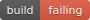

# svg-badge

Create your original badges

## Usual badges

You can create badges widely used by your own!





## Original badges

You can also create original badges!


etc...

## How to use as a library

```scala
import scala.xml.Elem
import io.github.nwtgck.svg_badge.SvgBadgeMaker

val svg: Elem = SvgBadgeMaker.generate(width = 90, subjectWidth = 40, subjectText = "build", statusText = "passing", badgeColor = "#6c3")

// Then you can use `svg` variable, for example, `println(svg)` or something.
```

or (use `smartGenerate` which allows you not to specify widths)

```scala
import scala.xml.Elem
import io.github.nwtgck.svg_badge.SvgBadgeMaker

val svg: Elem = SvgBadgeMaker.smartGenerate(subjectText = "build", statusText = "passing", badgeColor = "#6c3")

// Then you can use `svg` variable, for example, `println(svg)` or something.
```

## How to use this as an executable program

```sh
$ cd <this repo>
$ sbt "runMain io.github.nwtgck.svg_badge.Main" <subject:String> <status:String> <color:String> 
``` 

### Example - [build | passing]

```sh
$ sbt "runMain io.github.nwtgck.svg_badge.Main build passing #6c3" 
```

Then you can get `'./build-passing.svg'`


